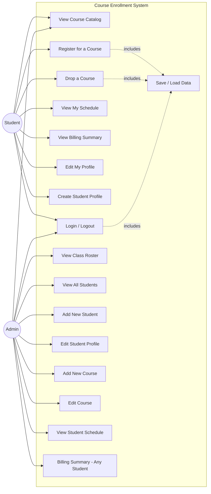
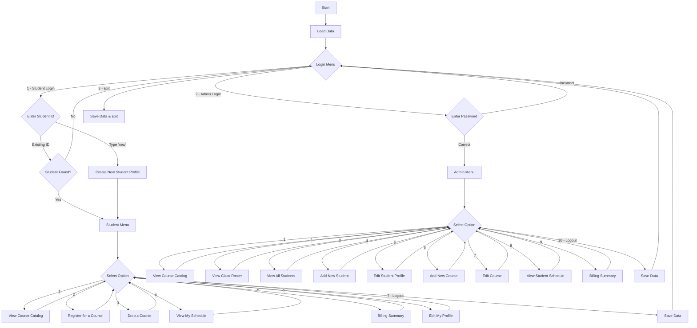

# unknownapp
This is an unknown application written in Java

## What is this program?

This is a **Course Enrollment System** — a command-line application that allows **Students** and **Administrators** to manage course registrations at a university.

### Key Features
- **Student role**: View course catalog, register/drop courses (with prerequisite, capacity, and time-conflict checks), view schedule, view billing summary, and edit profile.
- **Admin role**: All student features plus managing students and courses, viewing class rosters, and viewing any student's schedule/billing.
- **Data persistence**: All data is saved to and loaded from JSON files (`data/students.json`, `data/courses.json`).

---- For Submission (you must fill in the information below) ----

### Use Case Diagram

### Flowchart of the main workflow

### Prompts

I used the following prompts with an AI assistant to help create the Python version of the Student Course Registration use case:

**Prompt 2 — Generating the Python code:**
> "Create a Python command-line program that replicates the Student portion of this Java Course Enrollment System. It should:
> 1. Load courses and students from JSON files (same format as the Java version).
> 2. Let a student log in by ID or create a new profile.
> 3. Provide a menu with: View Catalog, Register for a Course, Drop a Course, View Schedule, Billing Summary, Edit Profile, Logout.
> 4. When registering, enforce: no duplicate enrollment, capacity limits, prerequisite checks, and time-slot conflict detection.
> 5. Save data back to JSON on logout or exit.
> Use classes for Course, Student, TimeSlot, EnrollmentSystem, and DataManager, mirroring the Java structure."

